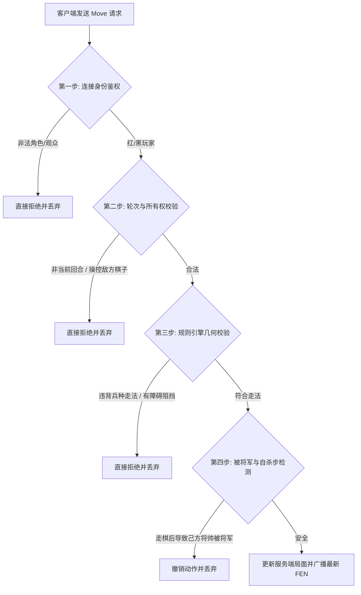

# 象棋远程对战防作弊安全架构设计

本文档详细描述了本项目中国象棋远程对战功能的**防作弊安全设计**与**核心逻辑实现**。

## 1. 核心设计原则：零信任客户端 (Zero-Trust Client)

在传统的网络对战游戏中，许多外挂和作弊手段源于客户端拥有过大的计算和状态决定权。为了彻底杜绝此类作弊，本项目采用**“零信任客户端”**架构：

- **唯一状态可信源**：棋局的真实状态（包括每个格子的棋子布局、当前的回合数、历史走法记录等）只保存在 Rust 服务端内存中。
- **单向状态同步**：服务端通过 WebSocket 协议向客户端单向广播最新局面（FEN）。客户端仅作为“显示终端”，无权直接覆写或修改服务端的局面状态。
- **原语化操作请求**：客户端发起移动时，**不传递 FEN 字符串**，而仅传递源坐标和目标坐标的移动原语（例如：移动 `src: 147, dst: 131`），由服务端对其进行合法性推演。

---

## 2. 校验流程设计

每次客户端提交移动请求时，Rust 服务端会进行多维度的链式安全性校验：

### 2.1 身份鉴权 (Authentication)

- 房间创建时，服务端在内存中生成该房间唯一的红方 Token 与黑方 Token（UUID 字符串）。
- 当 WebSocket 连接进入时，服务端读取 query 中的 `token` 参数并绑定角色：
  - `token == red_token` $\rightarrow$ 识别为 **红方玩家 (`PlayerRole::Red`)**，且绑定连接。
  - `token == black_token` $\rightarrow$ 识别为 **黑方玩家 (`PlayerRole::Black`)**，且绑定连接。
  - 无效或缺失 Token $\rightarrow$ 降级为 **观众 (`PlayerRole::Spectator`)**，不具备任何游戏写权限。

### 2.2 轮次与所有权校验 (Turn & Ownership Check)

- **轮次检测**：服务端检查当前棋局执子方。如果是红方回合，黑方玩家提交的任何移动请求都会被拦截。
- **棋子归属检测**：服务端检查起点 `src` 格子上的棋子。红方玩家仅被允许移动红方棋子（数字范围 `8..15`），黑方玩家仅被允许移动黑方棋子（数字范围 `16..22`）。防止玩家跨过网络移动或删除对手的棋子。

### 2.3 几何规则引擎校验 (Rules Verification)

服务端的象棋规则引擎对各个兵种的移动逻辑实施严格的物理限制：

- **将/帅 / 士**：目标位置必须在九宫格内，且步长限制为 1（将帅水平直行，士斜行）。
- **象**：绝对不能越过河界，且行进方式必须为 $2 \times 2$ 对角线。校验中点（象眼）是否为空。
- **马**：行进方式为 $2 \times 1$ 折线。根据马脚位置校验是否存在**蹩马腿**阻挡。
- **车**：直线行进。校验起点和终点连线中间的棋子数必须为 0。
- **炮**：
  - 若为移动（终点为空）：中间的阻挡棋子数必须为 0。
  - 若为吃子（终点为敌子）：中间的阻挡棋子数必须有且仅有 1 个（**炮架**）。
- **兵/卒**：在己方阵地只能向前 1 步。过河后，可向前、左、右移动 1 步，在任何情况下均不得后退。

### 2.4 被将军与自杀步检测 (Check Detection)

中国象棋规定玩家走子后不能使己方将帅暴露在敌方的攻击火力下。

1. 规则引擎在模拟该走法后，会在内存中以当前落子者视角执行一次**将军检测** (`checked()`)。
2. 扫描己方将帅的各个放射方向，检查是否有敌方的车/炮直面我方将帅，或是否有马/兵正处于能将军的对角/攻击点上。
3. 若检测到己方将帅被将军，该走法会被判定为**非法的自杀步**，服务端回滚移动并丢弃请求。

---

## 3. 共识控制机制 (Mutual Consent)

为了防止玩家通过恶意操纵网络请求单方面悔棋或强行重新开始局：

- **悔棋/重局需确认**：在双方均在线 of 局中，悔棋（`RequestRetract`）和重开（`RequestRestart`）命令将被挂起，并发送确认提示给对手。只有当对手响应同意（`agree: true`）时，服务端才会执行修改。
- **基于历史的推演回退**：悔棋通过后，服务端不是简单地进行“倒车”或读取客户端传回的状态，而是**清空当前 Board，从初始 FEN 起，依次重放历史 moves（除了最后一步）**。这从底层上消除了任何通过修改本地内存状态骗取服务端同步历史局面的可能性。
